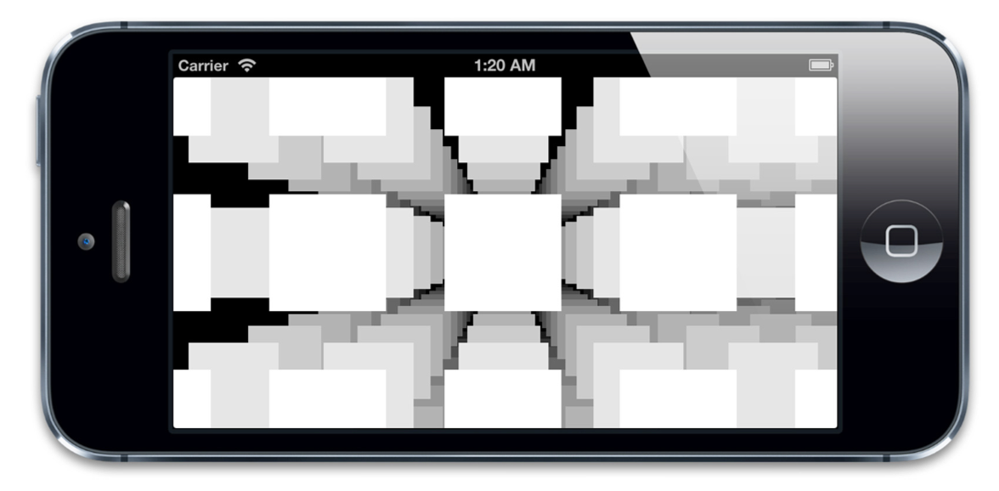

# 图层性能

>要更快性能，也要做对正确的事情。
>——Stephen R. Covey

在第14章『图像IO』讨论如何高效地载入和显示图像，通过视图来避免可能引起动画帧率下降的性能问题。在最后一章，我们将着重图层树本身，以发掘最好的性能。

## 隐式绘制

寄宿图可以通过Core Graphics直接绘制，也可以直接载入一个图片文件并赋值给`contents`属性，或事先绘制一个屏幕之外的`CGContext`上下文。在之前的两章中我们讨论了这些场景下的优化。但是除了常见的显式创建寄宿图，你也可以通过以下三种方式创建隐式的：1，使用特性的图层属性。2，特定的视图。3，特定的图层子类。

了解这个情况为什么发生何时发生是很重要的，它能够让你避免引入不必要的软件绘制行为。

### 文本

`CATextLayer`和`UILabel`都是直接将文本绘制在图层的寄宿图中。事实上这两种方式用了完全不同的渲染方式：在iOS 6及之前，`UILabel`用WebKit的HTML渲染引擎来绘制文本，而`CATextLayer`用的是Core Text.后者渲染更迅速，所以在所有需要绘制大量文本的情形下都优先使用它吧。但是这两种方法都用了软件的方式绘制，因此他们实际上要比硬件加速合成方式要慢。

不论如何，尽可能地避免改变那些包含文本的视图的frame，因为这样做的话文本就需要重绘。例如，如果你想在图层的角落里显示一段静态的文本，但是这个图层经常改动，你就应该把文本放在一个子图层中。

### 光栅化

在第四章『视觉效果』中我们提到了`CALayer`的`shouldRasterize`属性，它可以解决重叠透明图层的混合失灵问题。同样在第12章『速度的曲调』中，它也是作为绘制复杂图层树结构的优化方法。

启用`shouldRasterize`属性会将图层绘制到一个屏幕之外的图像。然后这个图像将会被缓存起来并绘制到实际图层的`contents`和子图层。如果有很多的子图层或者有复杂的效果应用，这样做就会比重绘所有事务的所有帧划得来得多。但是光栅化原始图像需要时间，而且还会消耗额外的内存。

当我们使用得当时，光栅化可以提供很大的性能优势（如你在第12章所见），但是一定要避免作用在内容不断变动的图层上，否则它缓存方面的好处就会消失，而且会让性能变的更糟。

为了检测你是否正确地使用了光栅化方式，用Instrument查看一下Color Hits Green和Misses Red项目，是否已光栅化图像被频繁地刷新（这样就说明图层并不是光栅化的好选择，或则你无意间触发了不必要的改变导致了重绘行为）。

## 离屏渲染

Offscreen rendering does not necessarily imply software drawing, but it means that the layer must first be rendered (either by the CPU or GPU) into an offscreen context before being displayed. The layer attributes that trigger offscreen rendering are as follows:

当图层属性的混合体被指定为在未预合成之前不能直接在屏幕中绘制时，屏幕外渲染就被唤起了。屏幕外渲染并不意味着软件绘制，但是它意味着图层必须在被显示之前在一个屏幕外上下文中被渲染（不论CPU还是GPU）。图层的以下属性将会触发屏幕外绘制：

* 圆角（当和`maskToBounds`一起使用时）
* 图层蒙板
* 阴影

屏幕外渲染和我们启用光栅化时相似，除了它并没有像光栅化图层那么消耗大，子图层并没有被影响到，而且结果也没有被缓存，所以不会有长期的内存占用。但是，如果太多图层在屏幕外渲染依然会影响到性能。

有时候我们可以把那些需要屏幕外绘制的图层开启光栅化以作为一个优化方式，前提是这些图层并不会被频繁地重绘。

对于那些需要动画而且要在屏幕外渲染的图层来说，你可以用`CAShapeLayer`，`contentsCenter`或者`shadowPath`来获得同样的表现而且较少地影响到性能。

### CAShapeLayer

`cornerRadius`和`maskToBounds`独立作用的时候都不会有太大的性能问题，但是当他俩结合在一起，就触发了屏幕外渲染。有时候你想显示圆角并沿着图层裁切子图层的时候，你可能会发现你并不需要沿着圆角裁切，这个情况下用`CAShapeLayer`就可以避免这个问题了。

你想要的只是圆角且沿着矩形边界裁切，同时还不希望引起性能问题。其实你可以用现成的`UIBezierPath`的构造器`+bezierPathWithRoundedRect:cornerRadius:`（见清单15.1）.这样做并不会比直接用`cornerRadius`更快，但是它避免了性能问题。

清单15.1 用`CAShapeLayer`画一个圆角矩形

```objective-c
#import "ViewController.h"
#import <QuartzCore/QuartzCore.h>

@interface ViewController ()

@property (nonatomic, weak) IBOutlet UIView *layerView;

@end

@implementation ViewController

- (void)viewDidLoad
{
    [super viewDidLoad];

    //create shape layer
    CAShapeLayer *blueLayer = [CAShapeLayer layer];
    blueLayer.frame = CGRectMake(50, 50, 100, 100);
    blueLayer.fillColor = [UIColor blueColor].CGColor;
    blueLayer.path = [UIBezierPath bezierPathWithRoundedRect:
    CGRectMake(0, 0, 100, 100) cornerRadius:20].CGPath;
    
    //add it to our view
    [self.layerView.layer addSublayer:blueLayer];
}
@end
```

### 可伸缩图片

另一个创建圆角矩形的方法就是用一个圆形内容图片并结合第二章『寄宿图』提到的`contensCenter`属性去创建一个可伸缩图片（见清单15.2）.理论上来说，这个应该比用`CAShapeLayer`要快，因为一个可拉伸图片只需要18个三角形（一个图片是由一个3*3网格渲染而成），然而，许多都需要渲染成一个顺滑的曲线。在实际应用上，二者并没有太大的区别。

清单15.2 用可伸缩图片绘制圆角矩形

```objective-c
@implementation ViewController

- (void)viewDidLoad
{
    [super viewDidLoad];

    //create layer
    CALayer *blueLayer = [CALayer layer];
    blueLayer.frame = CGRectMake(50, 50, 100, 100);
    blueLayer.contentsCenter = CGRectMake(0.5, 0.5, 0.0, 0.0);
    blueLayer.contentsScale = [UIScreen mainScreen].scale;
    blueLayer.contents = (__bridge id)[UIImage imageNamed:@"Circle.png"].CGImage;
    //add it to our view
    [self.layerView.layer addSublayer:blueLayer];
}
@end
```

使用可伸缩图片的优势在于它可以绘制成任意边框效果而不需要额外的性能消耗。举个例子，可伸缩图片甚至还可以显示出矩形阴影的效果。

### shadowPath

在第2章我们有提到`shadowPath`属性。如果图层是一个简单几何图形如矩形或者圆角矩形（假设不包含任何透明部分或者子图层），创建出一个对应形状的阴影路径就比较容易，而且Core Animation绘制这个阴影也相当简单，避免了屏幕外的图层部分的预排版需求。这对性能来说很有帮助。

如果你的图层是一个更复杂的图形，生成正确的阴影路径可能就比较难了，这样子的话你可以考虑用绘图软件预先生成一个阴影背景图。

## 混合和过度绘制

在第12章有提到，GPU每一帧可以绘制的像素有一个最大限制（就是所谓的fill rate），这个情况下可以轻易地绘制整个屏幕的所有像素。但是如果由于重叠图层的关系需要不停地重绘同一区域的话，掉帧就可能发生了。

GPU会放弃绘制那些完全被其他图层遮挡的像素，但是要计算出一个图层是否被遮挡也是相当复杂并且会消耗处理器资源。同样，合并不同图层的透明重叠像素（即混合）消耗的资源也是相当客观的。所以为了加速处理进程，不到必须时刻不要使用透明图层。任何情况下，你应该这样做：

* 给视图的`backgroundColor`属性设置一个固定的，不透明的颜色
* 设置`opaque`属性为YES

这样做减少了混合行为（因为编译器知道在图层之后的东西都不会对最终的像素颜色产生影响）并且计算得到了加速，避免了过度绘制行为因为Core Animation可以舍弃所有被完全遮盖住的图层，而不用每个像素都去计算一遍。

如果用到了图像，尽量避免透明除非非常必要。如果图像要显示在一个固定的背景颜色或是固定的背景图之前，你没必要相对前景移动，你只需要预填充背景图片就可以避免运行时混色了。

如果是文本的话，一个白色背景的`UILabel`（或者其他颜色）会比透明背景要更高效。

最后，明智地使用`shouldRasterize`属性，可以将一个固定的图层体系折叠成单张图片，这样就不需要每一帧重新合成了，也就不会有因为子图层之间的混合和过度绘制的性能问题了。

## 减少图层数量

初始化图层，处理图层，打包通过IPC发给渲染引擎，转化成OpenGL几何图形，这些是一个图层的大致资源开销。事实上，一次性能够在屏幕上显示的最大图层数量也是有限的。

确切的限制数量取决于iOS设备，图层类型，图层内容和属性等。但是总得说来可以容纳上百或上千个，下面我们将演示即使图层本身并没有做什么也会遇到的性能问题。

### 裁切

在对图层做任何优化之前，你需要确定你不是在创建一些不可见的图层，图层在以下几种情况下回事不可见的：

* 图层在屏幕边界之外，或是在父图层边界之外。
* 完全在一个不透明图层之后。
* 完全透明

Core Animation非常擅长处理对视觉效果无意义的图层。但是经常性地，你自己的代码会比Core Animation更早地想知道一个图层是否是有用的。理想状况下，在图层对象在创建之前就想知道，以避免创建和配置不必要图层的额外工作。

举个例子。清单15.3 的代码展示了一个简单的滚动3D图层矩阵。这看上去很酷，尤其是图层在移动的时候（见图15.1），但是绘制他们并不是很麻烦，因为这些图层就是一些简单的矩形色块。

清单15.3 绘制3D图层矩阵

```objective-c
#import "ViewController.h"
#import <QuartzCore/QuartzCore.h>

#define WIDTH 10
#define HEIGHT 10
#define DEPTH 10
#define SIZE 100
#define SPACING 150
#define CAMERA_DISTANCE 500

@interface ViewController ()

@property (nonatomic, strong) IBOutlet UIScrollView *scrollView;

@end

@implementation ViewController

- (void)viewDidLoad
{
    [super viewDidLoad];

    //set content size
    self.scrollView.contentSize = CGSizeMake((WIDTH - 1)*SPACING, (HEIGHT - 1)*SPACING);

    //set up perspective transform
    CATransform3D transform = CATransform3DIdentity;
    transform.m34 = -1.0 / CAMERA_DISTANCE;
    self.scrollView.layer.sublayerTransform = transform;

    //create layers
    for (int z = DEPTH - 1; z >= 0; z--) {
        for (int y = 0; y < HEIGHT; y++) {
            for (int x = 0; x < WIDTH; x++) {
                //create layer
                CALayer *layer = [CALayer layer];
                layer.frame = CGRectMake(0, 0, SIZE, SIZE);
                layer.position = CGPointMake(x*SPACING, y*SPACING);
                layer.zPosition = -z*SPACING;
                //set background color
                layer.backgroundColor = [UIColor colorWithWhite:1-z*(1.0/DEPTH) alpha:1].CGColor;
                //attach to scroll view
                [self.scrollView.layer addSublayer:layer];
            }
        }
    }
    
    //log
    NSLog(@"displayed: %i", DEPTH*HEIGHT*WIDTH);
}
@end
```



图15.1 滚动的3D图层矩阵

`WIDTH`，`HEIGHT`和`DEPTH`常量控制着图层的生成。在这个情况下，我们得到的是10\*10\*10个图层，总量为1000个，不过一次性显示在屏幕上的大约就几百个。

如果把`WIDTH`和`HEIGHT`常量增加到100，我们的程序就会慢得像龟爬了。这样我们有了100000个图层，性能下降一点儿也不奇怪。

但是显示在屏幕上的图层数量并没有增加，那么根本没有额外的东西需要绘制。程序慢下来的原因其实是因为在管理这些图层上花掉了不少功夫。他们大部分对渲染的最终结果没有贡献，但是在丢弃这么图层之前，Core Animation要强制计算每个图层的位置，就这样，我们的帧率就慢了下来。

我们的图层是被安排在一个均匀的栅格中，我们可以计算出哪些图层会被最终显示在屏幕上，根本不需要对每个图层的位置进行计算。这个计算并不简单，因为我们还要考虑到透视的问题。如果我们直接这样做了，Core Animation就不用费神了。

既然这样，让我们来重构我们的代码吧。改造后，随着视图的滚动动态地实例化图层而不是事先都分配好。这样，在创造他们之前，我们就可以计算出是否需要他。接着，我们增加一些代码去计算可视区域这样就可以排除区域之外的图层了。清单15.4是改造后的结果。

清单15.4 排除可视区域之外的图层

```objective-c
#import "ViewController.h"
#import <QuartzCore/QuartzCore.h>

#define WIDTH 100
#define HEIGHT 100
#define DEPTH 10
#define SIZE 100
#define SPACING 150
#define CAMERA_DISTANCE 500
#define PERSPECTIVE(z) (float)CAMERA_DISTANCE/(z + CAMERA_DISTANCE)

@interface ViewController () <UIScrollViewDelegate>

@property (nonatomic, weak) IBOutlet UIScrollView *scrollView;

@end

@implementation ViewController

- (void)viewDidLoad
{
    [super viewDidLoad];
    //set content size
    self.scrollView.contentSize = CGSizeMake((WIDTH - 1)*SPACING, (HEIGHT - 1)*SPACING);
    //set up perspective transform
    CATransform3D transform = CATransform3DIdentity;
    transform.m34 = -1.0 / CAMERA_DISTANCE;
    self.scrollView.layer.sublayerTransform = transform;
}

- (void)viewDidLayoutSubviews
{
    [self updateLayers];
}

- (void)scrollViewDidScroll:(UIScrollView *)scrollView
{
    [self updateLayers];
}

- (void)updateLayers
{
    //calculate clipping bounds
    CGRect bounds = self.scrollView.bounds;
    bounds.origin = self.scrollView.contentOffset;
    bounds = CGRectInset(bounds, -SIZE/2, -SIZE/2);
    //create layers
    NSMutableArray *visibleLayers = [NSMutableArray array];
    for (int z = DEPTH - 1; z >= 0; z--)
    {
        //increase bounds size to compensate for perspective
        CGRect adjusted = bounds;
        adjusted.size.width /= PERSPECTIVE(z*SPACING);
        adjusted.size.height /= PERSPECTIVE(z*SPACING);
        adjusted.origin.x -= (adjusted.size.width - bounds.size.width) / 2;
        adjusted.origin.y -= (adjusted.size.height - bounds.size.height) / 2;
        for (int y = 0; y < HEIGHT; y++) {
        //check if vertically outside visible rect
            if (y*SPACING < adjusted.origin.y || y*SPACING >= adjusted.origin.y + adjusted.size.height)
            {
                continue;
            }
            for (int x = 0; x < WIDTH; x++) {
                //check if horizontally outside visible rect
                if (x*SPACING < adjusted.origin.x ||x*SPACING >= adjusted.origin.x + adjusted.size.width)
                {
                    continue;
                }
                
                //create layer
                CALayer *layer = [CALayer layer];
                layer.frame = CGRectMake(0, 0, SIZE, SIZE);
                layer.position = CGPointMake(x*SPACING, y*SPACING);
                layer.zPosition = -z*SPACING;
                //set background color
                layer.backgroundColor = [UIColor colorWithWhite:1-z*(1.0/DEPTH) alpha:1].CGColor;
                //attach to scroll view
                [visibleLayers addObject:layer];
            }
        }
    }
    //update layers
    self.scrollView.layer.sublayers = visibleLayers;
    //log
    NSLog(@"displayed: %i/%i", [visibleLayers count], DEPTH*HEIGHT*WIDTH);
}
@end
```

这个计算机制并不具有普适性，但是原则上是一样。（当你用一个`UITableView`或者`UICollectionView`时，系统做了类似的事情）。这样做的结果？我们的程序可以处理成百上千个『虚拟』图层而且完全没有性能问题！因为它不需要一次性实例化几百个图层。

### 对象回收

处理巨大数量的相似视图或图层时还有一个技巧就是回收他们。对象回收在iOS颇为常见；`UITableView`和`UICollectionView`都有用到，`MKMapView`中的动画pin码也有用到，还有其他很多例子。

对象回收的基础原则就是你需要创建一个相似对象池。当一个对象的指定实例（本例子中指的是图层）结束了使命，你把它添加到对象池中。每次当你需要一个实例时，你就从池中取出一个。当且仅当池中为空时再创建一个新的。

这样做的好处在于避免了不断创建和释放对象（相当消耗资源，因为涉及到内存的分配和销毁）而且也不必给相似实例重复赋值。

好了，让我们再次更新代码吧（见清单15.5）

清单15.5 通过回收减少不必要的分配

```objective-c
@interface ViewController () <UIScrollViewDelegate>

@property (nonatomic, weak) IBOutlet UIScrollView *scrollView;
@property (nonatomic, strong) NSMutableSet *recyclePool;


@end

@implementation ViewController

- (void)viewDidLoad
{
    [super viewDidLoad]; //create recycle pool
    self.recyclePool = [NSMutableSet set];
    //set content size
    self.scrollView.contentSize = CGSizeMake((WIDTH - 1)*SPACING, (HEIGHT - 1)*SPACING);
    //set up perspective transform
    CATransform3D transform = CATransform3DIdentity;
    transform.m34 = -1.0 / CAMERA_DISTANCE;
    self.scrollView.layer.sublayerTransform = transform;
}

- (void)viewDidLayoutSubviews
{
    [self updateLayers];
}

- (void)scrollViewDidScroll:(UIScrollView *)scrollView
{
    [self updateLayers];
}

- (void)updateLayers {
    
    //calculate clipping bounds
    CGRect bounds = self.scrollView.bounds;
    bounds.origin = self.scrollView.contentOffset;
    bounds = CGRectInset(bounds, -SIZE/2, -SIZE/2);
    //add existing layers to pool
    [self.recyclePool addObjectsFromArray:self.scrollView.layer.sublayers];
    //disable animation
    [CATransaction begin];
    [CATransaction setDisableActions:YES];
    //create layers
    NSInteger recycled = 0;
    NSMutableArray *visibleLayers = [NSMutableArray array];
    for (int z = DEPTH - 1; z >= 0; z--)
    {
        //increase bounds size to compensate for perspective
        CGRect adjusted = bounds;
        adjusted.size.width /= PERSPECTIVE(z*SPACING);
        adjusted.size.height /= PERSPECTIVE(z*SPACING);
        adjusted.origin.x -= (adjusted.size.width - bounds.size.width) / 2; adjusted.origin.y -= (adjusted.size.height - bounds.size.height) / 2;
        for (int y = 0; y < HEIGHT; y++) {
            //check if vertically outside visible rect
            if (y*SPACING < adjusted.origin.y ||
                y*SPACING >= adjusted.origin.y + adjusted.size.height)
            {
                continue;
            }
            for (int x = 0; x < WIDTH; x++) {
                //check if horizontally outside visible rect
                if (x*SPACING < adjusted.origin.x ||
                    x*SPACING >= adjusted.origin.x + adjusted.size.width)
                {
                    continue;
                }
                //recycle layer if available
                CALayer *layer = [self.recyclePool anyObject]; if (layer)
                {
                    
                    recycled ++;
                    [self.recyclePool removeObject:layer]; }
                else
                {
                    layer = [CALayer layer];
                    layer.frame = CGRectMake(0, 0, SIZE, SIZE); }
                //set position
                layer.position = CGPointMake(x*SPACING, y*SPACING); layer.zPosition = -z*SPACING;
                //set background color
                layer.backgroundColor =
                [UIColor colorWithWhite:1-z*(1.0/DEPTH) alpha:1].CGColor;
                //attach to scroll view
                [visibleLayers addObject:layer]; }
        } }
    [CATransaction commit]; //update layers
    self.scrollView.layer.sublayers = visibleLayers;
    //log
    NSLog(@"displayed: %i/%i recycled: %i",
          [visibleLayers count], DEPTH*HEIGHT*WIDTH, recycled);
}
@end
```

本例中，我们只有图层对象这一种类型，但是UIKit有时候用一个标识符字符串来区分存储在不同对象池中的不同的可回收对象类型。

你可能注意到当设置图层属性时我们用了一个`CATransaction`来抑制动画效果。在之前并不需要这样做，因为在显示之前我们给所有图层设置一次属性。但是既然图层正在被回收，禁止隐式动画就有必要了，不然当属性值改变时，图层的隐式动画就会被触发。

### Core Graphics绘制

当排除掉对屏幕显示没有任何贡献的图层或者视图之后，长远看来，你可能仍然需要减少图层的数量。例如，如果你正在使用多个`UILabel`或者`UIImageView`实例去显示固定内容，你可以把他们全部替换成一个单独的视图，然后用`-drawRect:`方法绘制出那些复杂的视图层级。

这个提议看上去并不合理因为大家都知道软件绘制行为要比GPU合成要慢而且还需要更多的内存空间，但是在因为图层数量而使得性能受限的情况下，软件绘制很可能提高性能呢，因为它避免了图层分配和操作问题。

你可以自己实验一下这个情况，它包含了性能和栅格化的权衡，但是意味着你可以从图层树上去掉子图层（用`shouldRasterize`，与完全遮挡图层相反）。

### -renderInContext: 方法

用Core Graphics去绘制一个静态布局有时候会比用层级的`UIView`实例来得快，但是使用`UIView`实例要简单得多而且比用手写代码写出相同效果要可靠得多，更边说Interface Builder来得直接明了。为了性能而舍弃这些便利实在是不应该。

幸好，你不必这样，如果大量的视图或者图层真的关联到了屏幕上将会是一个大问题。没有与图层树相关联的图层不会被送到渲染引擎，也没有性能问题（在他们被创建和配置之后）。

使用`CALayer`的`-renderInContext:`方法，你可以将图层及其子图层快照进一个Core Graphics上下文然后得到一个图片，它可以直接显示在`UIImageView`中，或者作为另一个图层的`contents`。不同于`shouldRasterize` —— 要求图层与图层树相关联 —— ，这个方法没有持续的性能消耗。

当图层内容改变时，刷新这张图片的机会取决于你（不同于`shouldRasterize`，它自动地处理缓存和缓存验证），但是一旦图片被生成，相比于让Core Animation处理一个复杂的图层树，你节省了相当客观的性能。

## 总结

本章学习了使用Core Animation图层可能遇到的性能瓶颈，并讨论了如何避免或减小压力。你学习了如何管理包含上千虚拟图层的场景（事实上只创建了几百个）。同时也学习了一些有用的技巧，选择性地选取光栅化或者绘制图层内容在合适的时候重新分配给CPU和GPU。这些就是我们要讲的关于Core Animation的全部了（至少可以等到苹果发明什么新的玩意儿）。
